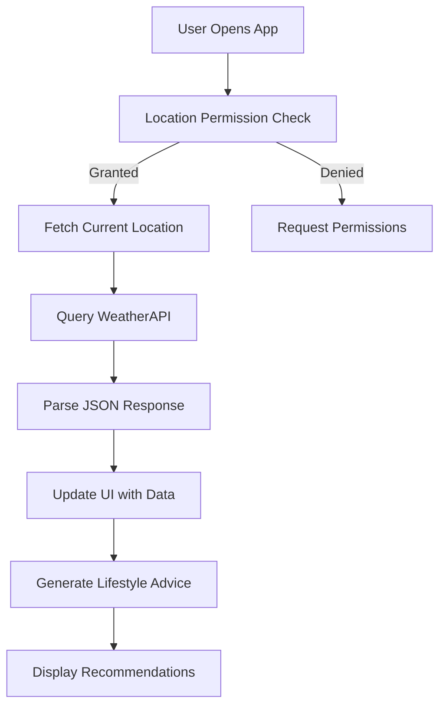
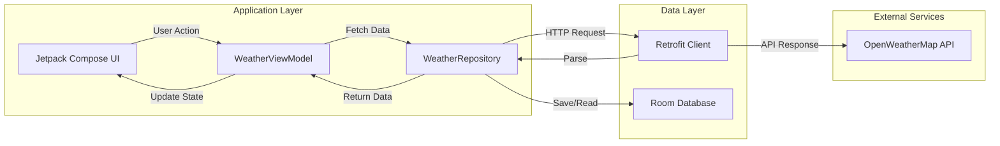

# 🌦️ WeatherWise: Smart Weather & Lifestyle Advisor

[]()
[]()
[]()

**WeatherWise** is an intelligent Android application that goes beyond standard weather forecasting. It provides hyper-local, real-time weather data combined with personalized lifestyle recommendations, ensuring you always know what to wear, when to travel, and how to stay comfortable.

---

## ✨ Key Features

- **🌍 Hyper-Local Weather**: Real-time temperature, humidity, wind speed, and precipitation probability based on your precise location.
- **👗 Smart Outfit Advisor**: AI-powered suggestions for clothing and accessories based on current conditions and your personal profile.
- **🚗 Travel Forecast**: Predictive analysis for your daily commute or planned trips, alerting you to potential delays or discomfort.
- **📊 Historical Insights**: Track weather patterns over time to understand micro-climate trends in your area.
- **🎨 Dynamic UI**: A beautiful, responsive interface that adapts to the current weather conditions (e.g., dark mode for night, blue hues for clear skies).

---

## 🛠️ Technical Architecture

WeatherWise is built on a modern, modular architecture that ensures scalability and performance.

### System Flow



### Data Flow



---

## 💻 Tech Stack

- **Language**: Kotlin
- **UI Framework**: Jetpack Compose
- **Architecture**: MVVM (Model-View-ViewModel)
- **Networking**: Retrofit & OkHttp
- **Data Persistence**: Room (SQLite)
- **Location Services**: Fused Location Provider
- **Dependency Injection**: Hilt

---

## 📦 Installation & Setup

1. **Clone the Repository**:
   ```bash
   git clone https://github.com/your-repo/weatherwise.git
   ```
2. **API Key Setup**:
   - Obtain an API key from [OpenWeatherMap](https://openweathermap.org/).
   - Add the key to your `local.properties` file:
     ```properties
     api_key=your_actual_api_key_here
     ```
3. **Open in Android Studio**:
   Import the project as a Gradle project.
4. **Build & Run**:
   Sync Gradle and run the `app` module on an Android device (API 24+).

---

## 🔐 Required Permissions

WeatherWise needs the following permissions to function correctly:

| Permission | Purpose |
| :--- | :--- |
| `ACCESS_FINE_LOCATION` | To get precise GPS coordinates for accurate weather data. |
| `ACCESS_COARSE_LOCATION` | For general location access when GPS is not available. |

---

## 🤝 Contributing

Contributions are welcome! Please feel free to submit a Pull Request. For major changes, please open an issue first to discuss what you would like to change.

## 📄 License

This project is licensed under the MIT License - see the LICENSE file for details.

---
*Stay Informed, Stay Ahead with WeatherWise.*
